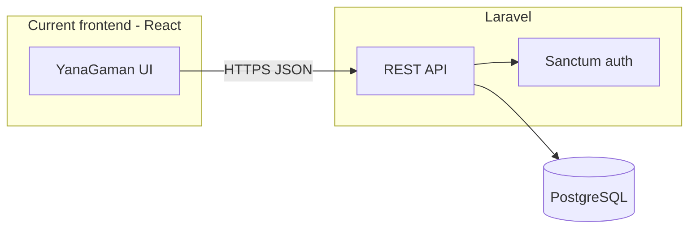

# Expansion roadmap: Laravel API + PostgreSQL

This document is the **startup plan** for moving from Firebase-backed auth and data to a **Laravel 11+ REST API** with **PostgreSQL**, while the **React (Vite) frontend stays** and switches to HTTP calls. It defines **portals** (admin, passenger, driver), a **sprint** breakdown, a **starter database schema**, **Firebase migration** notes, and **first setup** tasks.

**Related:** current Firebase usage in [DATABASE.md](./DATABASE.md); product context in [BUSINESS-MODEL.md](./BUSINESS-MODEL.md).

---

## 1. Target architecture



| Layer | Choice | Notes |
|--------|--------|--------|
| Frontend | Unchanged stack (React 19, Vite) | Replace `firebase` client with `fetch`/`axios` + token storage (memory + `httpOnly` cookie via Sanctum SPA mode, or Bearer tokens in `Authorization`—pick one pattern per environment). |
| API | Laravel REST (JSON) | Version prefix recommended: `/api/v1/...`. |
| Auth | Laravel Sanctum | Personal access tokens or SPA cookie authentication; issue token on login, revoke on logout. |
| DB | PostgreSQL 15+ | Single primary database; add read replicas later if needed. |
| File storage | Local or S3-compatible | For future KYC, avatars, etc. — not required for schema v1. |

**Portals (authorization, not separate apps yet):** one user has exactly one `role` for v1: `admin`, `passenger`, or `driver`. The React app can switch UI by `role` from `GET /api/v1/user` (or a dedicated `/me`); an **admin** area can be a route group protected server-side. Future: separate frontends reusing the same API.

---

## 2. Migration from Firebase

| Current (Firebase) | New (Laravel) |
|---------------------|---------------|
| Firebase Auth (email/password) | `users` + `password` hash (bcrypt) |
| `users/{uid}` in Realtime DB | `users` + `passenger_profiles` or `driver_profiles` |
| `emergency/{uid}` | `emergency_contacts` |
| Client SDK session | API token or Sanctum session |

**Important:** you **cannot** port password hashes from Firebase to Laravel. Plan one of:

1. **Cutover for new users only** — new registrations on Laravel; old users use **password reset** or **“set password”** email after migration.
2. **One-time import** — script reads Firebase Admin SDK export of users + RTDB; creates Laravel users with `password` = random, forces `password_change_required` (add column if you use this), sends reset emails.

**Order of operations:** build and test API + schema **before** cutover; run migration script in a maintenance window; point frontend to new `VITE_API_URL`; retire Firebase for this app when traffic is fully on the API.

Document RTDB field mapping explicitly in the migration script (see §4 naming alignment).

---

## 3. PostgreSQL schema (starter, v1)

Design goals: **3NF for core identity**, **role-specific tables** to avoid null sprawl, **emergency contacts** as first-class rows, **timestamps and soft constraints** for future admin tooling.

**Conventions:** `id` = bigserial PK; optional `public_id` (uuid) for opaque client references if you want to avoid exposing sequential IDs externally.

### 3.1 Enums (PostgreSQL)

```sql
CREATE TYPE user_role AS ENUM ('admin', 'passenger', 'driver');
CREATE TYPE user_status AS ENUM ('active', 'suspended', 'pending_verification');
CREATE TYPE vehicle_ownership AS ENUM ('own', 'company');
```

### 3.2 Tables (DDL-style reference)

**`users`** — authentication and shared identity.

| Column | Type | Notes |
|--------|------|--------|
| id | bigserial PK | |
| public_id | uuid UNIQUE NOT NULL DEFAULT gen_random_uuid() | Optional API exposure |
| email | citext UNIQUE NOT NULL | `citext` extension for case-insensitive email |
| password | varchar(255) | bcrypt hash |
| name | varchar(255) NOT NULL | |
| role | user_role NOT NULL | Exactly one portal role |
| status | user_status NOT NULL DEFAULT 'active' | |
| phone | varchar(32) | Nullable for admin if you allow |
| city | varchar(120) | Region / default area |
| company_name | varchar(255) | Optional; used by passengers/drivers in current UI |
| email_verified_at | timestamptz | Nullable |
| last_login_at | timestamptz | Optional analytics |
| created_at, updated_at | timestamptz | |

**Indexes:** `email`, `role`, `status`, `(role, status)`.

**`passenger_profiles`** — one row per `users.id` where `role = passenger` (enforced in app or with a constraint trigger).

| Column | Type | Notes |
|--------|------|--------|
| user_id | bigint PK, FK → users(id) ON DELETE CASCADE | |
| default_pickup | varchar(500) | Was `pickup` |
| default_drop_off | varchar(500) | Was `dropLocation` |
| same_evening_routine | boolean NOT NULL DEFAULT false | |
| created_at, updated_at | timestamptz | |

**`driver_profiles`** — one row per `role = driver`.

| Column | Type | Notes |
|--------|------|--------|
| user_id | bigint PK, FK → users(id) ON DELETE CASCADE | |
| vehicle_ownership | vehicle_ownership NOT NULL | Replaces string `vehicleType` |
| vehicle_number | varchar(64) | Empty or placeholder if company vehicle |
| created_at, updated_at | timestamptz | |

`company_name` for drivers stays on `users` to match a single `company_name` on the current forms.

**`emergency_contacts`**

| Column | Type | Notes |
|--------|------|--------|
| id | bigserial PK | |
| user_id | bigint NOT NULL, FK → users(id) ON DELETE CASCADE | Owner (typically passenger) |
| name | varchar(255) NOT NULL | |
| phone | varchar(32) NOT NULL | |
| relation | varchar(120) | Nullable |
| sort_order | smallint NOT NULL DEFAULT 0 | List order |
| created_at, updated_at | timestamptz | |

**Index:** `(user_id, sort_order)`.

### 3.3 Laravel + Sanctum

- **`personal_access_tokens`** — created by Sanctum migration (token name, abilities, `tokenable` polymorphic, etc.).
- **`password_reset_tokens`** — if using built-in password broker (email as key for Laravel default on PostgreSQL store appropriately).

### 3.4 Field mapping from Firebase → Postgres

| Firebase (`users/{uid}`) | Destination |
|--------------------------|------------|
| `name`, `email`, `phone`, `city`, `companyName` | `users` |
| `role` | `user_role` enum (`passenger` / `driver`; map `rider` → `passenger`) |
| `pickup`, `dropLocation`, `sameEveningRoutine` | `passenger_profiles` |
| `vehicleType` | `driver_profiles.vehicle_ownership` (normalize strings) |
| `vehicleNumber` | `driver_profiles.vehicle_number` |
| `emergency/{uid}[i]` | `emergency_contacts` rows with `sort_order` = array index |

---

## 4. REST API shape (v1, minimal for startup)

| Method | Path | Purpose |
|--------|------|---------|
| POST | `/api/v1/auth/register` | Register passenger or driver (body includes `role` + profile payload) |
| POST | `/api/v1/auth/login` | Returns token or sets cookie (Sanctum) |
| POST | `/api/v1/auth/logout` | Revoke current token |
| GET | `/api/v1/auth/user` or `/me` | Current user + role + nested profile |
| PUT/PATCH | `/api/v1/profile` | Update shared `users` fields |
| PUT/PATCH | `/api/v1/passenger/profile` | Passenger-only (route + routine) |
| PUT/PATCH | `/api/v1/driver/profile` | Driver-only (vehicle) |
| GET/POST/PUT/DELETE | `/api/v1/emergency-contacts` | CRUD for authenticated user’s contacts |
| *Admin* | `/api/v1/admin/...` | `role:admin` + policies (user list, suspend, etc.) — can be **Sprint 4+** |

Use **form requests** and **policies** so passengers cannot call driver-only routes. Return **JSON:API** or a consistent `{ data, message, errors }` envelope; pick one and document it in the API README.

CORS: allow the Vite dev origin and production frontend origin; credentials if using cookie-based Sanctum.

---

## 5. Sprints (suggested)

Durations are indicative; adjust to team size.

| Sprint | Goal | Deliverables |
|--------|------|----------------|
| **0 — Foundations (1 week)** | Repo + local env | New Laravel app in a sibling folder or `backend/`; PostgreSQL in Docker; `.env` documented; `php artisan serve` + DB migrate; health route `GET /api/v1/health`. |
| **1 — Schema + models** | Data layer live | Migrations for enums + tables above; Eloquent models + factories; **Sanctum** installed; **first admin** via seeder (never in git with prod password). |
| **2 — Auth API** | Frontend can log in | Register/login/logout, `/me` with role and profile; validation matches current form fields; PHPUnit/Pest feature tests. |
| **3 — Profile + emergency** | Parity with RTDB | PATCH profile endpoints; `emergency_contacts` CRUD; policies by role. |
| **4 — Frontend cutover (dev)** | Drop Firebase in dev | Vite `VITE_API_BASE_URL`; axios/fetch client with token; replace `src/firebase.js` and YanaGaman auth calls; feature flag to switch. |
| **5 — Admin API + minimal UI (optional)** | First admin tools | List users, toggle `status`, view profile; or expose only in Postman for v1. |
| **6 — Migration + prod cutover** | Production | Export Firebase; import script; DNS/env switch; monitor errors; decommission Firebase for this app. |
| **7+** | Product | Trips, subscriptions, payments — new tables, not in v1 schema. |

---

## 6. Immediate next steps (this week)

1. **Create the Laravel project** (new directory or `backend/`), add **PostgreSQL** connection string, enable **`citext`** (`CREATE EXTENSION IF NOT EXISTS citext;` in a migration or DB init script).
2. **Install Sanctum**, publish config, add `HasApiTokens` to `User` if using personal access tokens; configure CORS and `stateful` domains for frontend URL.
3. **Implement migrations** for §3 tables (or Laravel migrations generated from the DDL above); run `migrate`.
4. **Implement** `POST /api/v1/auth/register`, `POST /api/v1/auth/login`, `GET /api/v1/auth/user` with tests.
5. **OpenAPI or Postman collection** for the team so the React work can start in parallel.

---

## 7. Open decisions (log as you go)

- **Token model:** Bearer in `Authorization` (simplest for current SPA) vs Sanctum SPA **cookie** + CSRF (tighter for same-site).
- **Admin creation:** seeder + CLI only vs invite flow.
- **Phone verification:** out of scope for v1 or optional SMS later.
- **Monorepo:** `backend/` + existing React root vs two repositories.

---

## 8. Document history

| Version | Date | Notes |
|---------|------|--------|
| 1.0 | — | Initial expansion plan, schema v1, sprint outline |

When this plan changes, update the table and link from [PROJECT.md](./PROJECT.md) if the team keeps a single index there.
