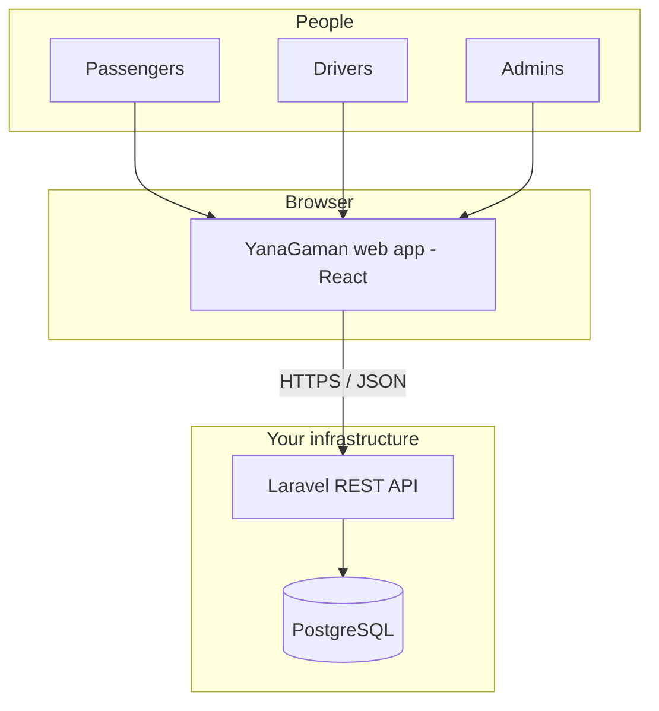

# YanaGaman - System designing

*High-level system design for the expanded platform (React client, Laravel API, PostgreSQL).*

**Related:** implementation plan in [EXPANSION-ROADMAP.md](./EXPANSION-ROADMAP.md); current Firebase usage in [DATABASE.md](./DATABASE.md).

---

## 1. Purpose

This document describes **what the system is made of** and **how parts talk to each other**—for stakeholders and engineers. It stays at the architecture level; database field lists and sprint work live in the roadmap.

---

## 2. System context

- **One web application** serves all three portals today: the interface changes by **role** (admin, passenger, driver) after sign-in.
- **No direct database access** from the browser; the app only calls the **API**.

---

## 3. Major components

| Component | Responsibility |
|-----------|------------------|
| **Web client (React + Vite)** | Pages, forms, dashboard, token or session handling, calls API instead of Firebase. |
| **API (Laravel)** | Business rules, validation, authentication, authorization by role, exposes versioned REST endpoints (e.g. `/api/v1/...`). |
| **Database (PostgreSQL)** | Durable storage for users, role-specific profiles, emergency contacts, and future trips/billing. |
| **Auth (Laravel Sanctum)** | Issues and checks access for each request; links a request to a `user` and their `role`. |

---

## 4. Logical boundaries

| Boundary | Rule |
|----------|------|
| **Client ↔ API** | Public internet; JSON only; secrets never shipped in frontend code except public config (e.g. API base URL). |
| **API ↔ Database** | Private network (same host, VPC, or managed DB); credentials only on the server. |
| **Roles** | Admin, passenger, and driver are **authorization** concerns: the API checks `role` (and policies) before returning or changing data. |

---

## 5. Data flow (typical request)

1. User signs in on the web app; client receives a **token** or **session** from the API (per Sanctum setup).
2. Client sends later requests with that credential and, when needed, a JSON body.
3. Laravel **authenticates** the user, **authorizes** the action for their role, reads or writes **PostgreSQL** through models.
4. API returns JSON; the React app updates the UI.

---

## 6. Migration note (current → target)

Today, sign-in and profile data use **Firebase**. The target design **replaces** that with the API + PostgreSQL; users are migrated with a **planned cutover** (see roadmap). The **web UI** can remain visually the same while the **data path** changes.

---

## 7. Out of scope for this design level (later modules)

- Real-time trip dispatch, live maps, payment gateways, and push notifications are **future** services that would sit behind the same API pattern and additional tables—not required to validate this system shape.

---

## 8. Document history

| Version | Notes |
|---------|--------|
| 1.0 | Initial system designing summary |
